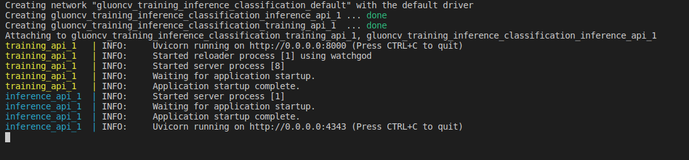
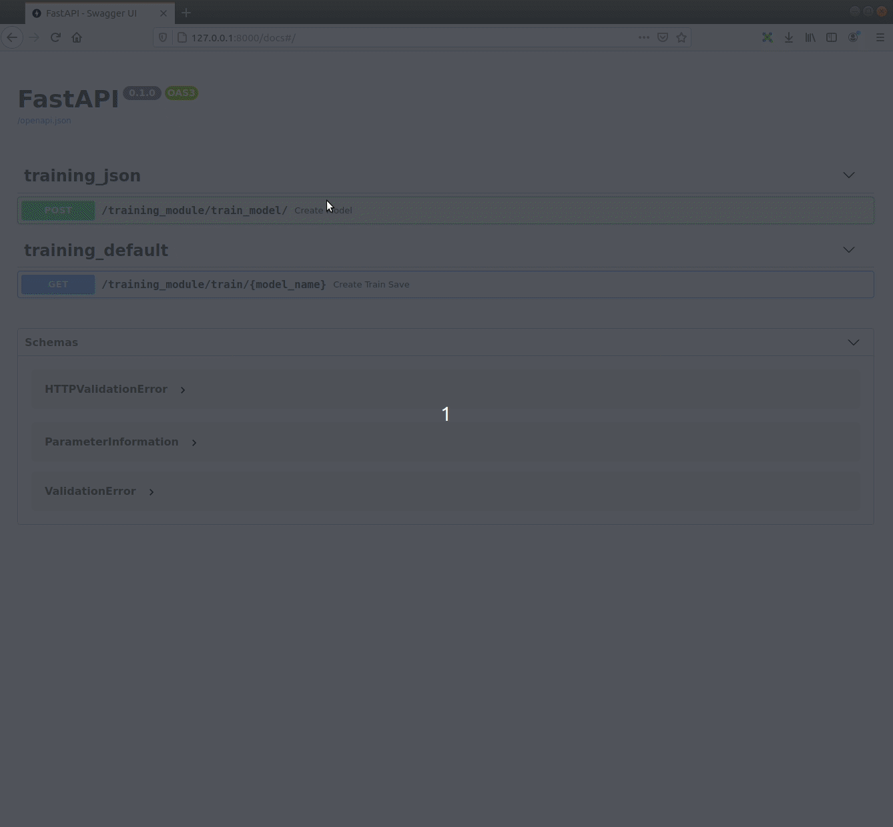
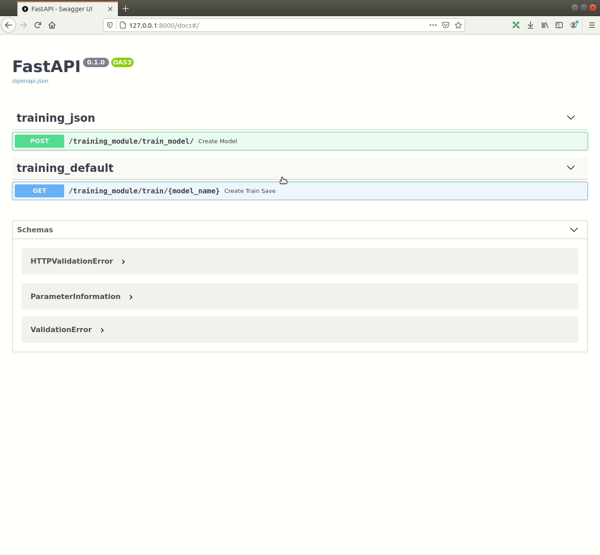
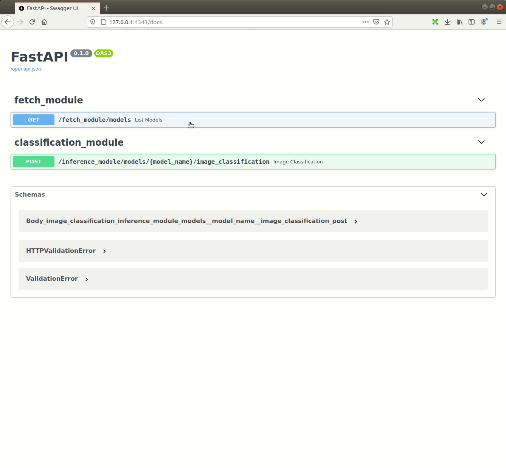
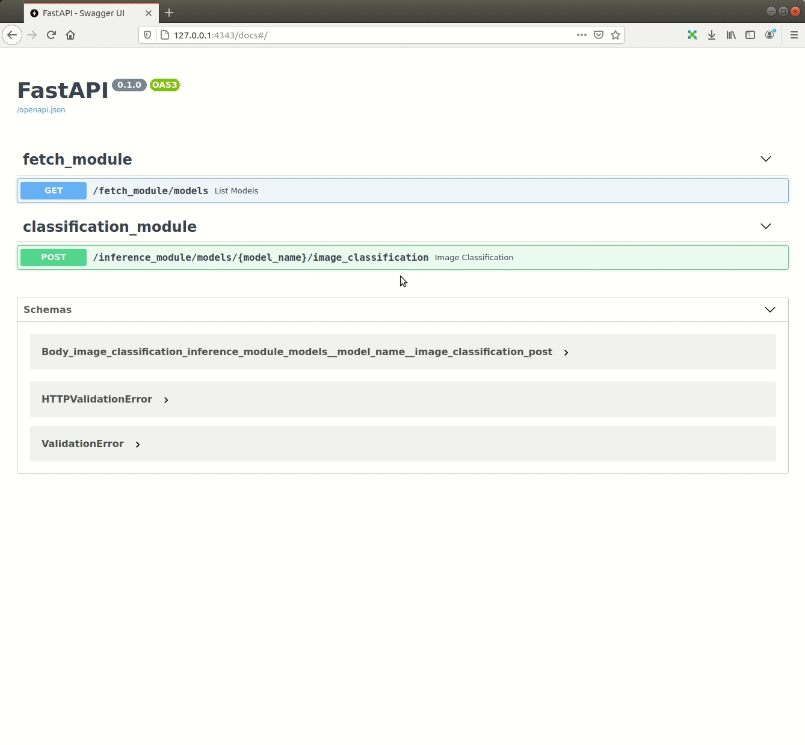

# GluonCV_Training_Inference_Classification_API

This is a repository for a classification training and inference API using the Gluoncv toolkit. It's supported on both Windows and Linux Operating systems.
**Note: To be able to fast train a model with the training_API repository make sure to use** `git clone` **and avoid downloading the repository as ZIP because it will not download the needed files stored on** `git lfs` **but just the pointer instead**

# Build_the_API


## Prerequisites 


- Ubuntu 18.04
- Docker CE latest stable release
- Docker-Compose (1.19.0 or higher)


#### How to check for prerequisites

**To check if you have docker-ce installed:** 

​		    	      `docker --version`

**To check if you have docker-compose installed:**

​     			     `docker-compose --version`


### Install prerequisites

### Ubuntu

#### Installing Prerequisites

- If you don't have neither docker nor docker-compose use the following  command 

  ​			`chmod +x install_full.sh && source install_full.sh`

- If you have docker ce installed and wish only to install docker-compose and perform necessary operations,  use the following command 

  ​			`chmod +x install_compose.sh && source install_compose.sh`


#### Windows 10

To [install Docker on Windows](https://docs.docker.com/docker-for-windows/install/), please follow the link.


## Build the Solution

To build the solution, run the following command from the repository's root directory

```sh
docker-compose -f build.yml build
```

## Run the Solution

To run the solution, run the following command from the repository's root directory

```sh
docker-compose -f run.yml up
```

After a successful run you should see something like the following:




## Usage

- If the app is deployed on your machine:  
  * open your web browser and type the following: `localhost:8000` or `127.0.0.1:8000  ` for the training API
  * open your web browser and type the following: `localhost:4343` or `127.0.0.1:4343  ` for the Inference API


- If the app is deployed on a different machine: open your web browser and type the following: `<machine_ip>:<port>`


### Endpoints summary

## Training_API

#### /train_model (POST)

Train a new model and pass the parameters using a json format object



#### /train/{model_name} (POST)

Train a new model and give only the model name as parameter




## Inference_API

#### /models (GET)

Loads all available models and returns every model with it's hashed value. Loaded models are stored and aren't loaded again.



#### /models/{model_name}/image_classification (POST)

Train a new model and give only the model name as parameter



## Acknowledgements

[gluoncv Toolkit](https://github.com/dmlc/gluon-cv)

[gluoncv and mxnet](https://cv.gluon.ai/build/examples_classification/demo_cifar10.html)

[Elio Hanna](https://github.com/Elio-hanna)